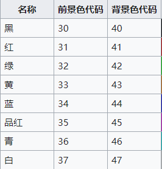
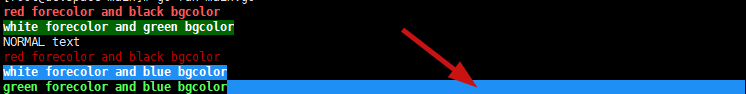

# go-ansi
项目主要根据ANSI的转移文本的语法  
对终端文字进行了颜色的改变  
文字颜色可通过前景色进行改变，然后背景颜色可通过  
后景色进行改变  

## ANSI的颜色对应表


## ANSI 代码规则
```go
\x1B[{30-37}m 设置前景色
\x1B[{40-47}m 设置后景色
\x1B[0m       清空之前的设置
\x1B[{30-37};1m 前景色字体变亮
\x1B[{30-37};{40-47};1m 设置前景色和后景色
默认前景色为白色，后景色是黑色
```
### 实例
参考color_test.go和main.go  
如果当前设置了背景色，  
fmt.Println()打印的时候，  
换行符进入下一行，所以下一行会立刻变成背景色。

